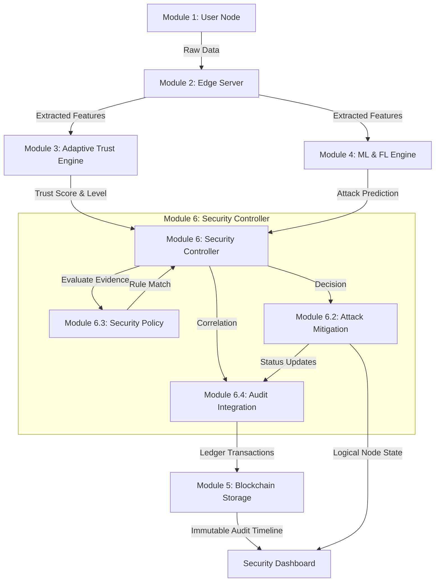

# TrustChain-5G Architecture

TrustChain-5G is a comprehensive, multi-module cybersecurity framework designed to secure 5G networks and edge computing environments. It combines lightweight feature extraction, adaptive trust evaluation, machine learning intrusion detection, blockchain-backed auditability, and automated security policy enforcement into a unified pipeline.

## System Overview

The system processes data from raw network nodes all the way through to final security mitigations and immutable blockchain records.

## Module Breakdown

### Module 1: User Nodes & Data Collection
Responsible for simulating or collecting raw 5G network traffic, device metrics, and connection behaviors from edge devices.

### Module 2: Edge Server & Feature Extraction
Ingests raw data streams and extracts critical security features (e.g., packet rates, protocol anomalies, connection duration) optimized for lightweight edge processing.

### Module 3: Adaptive Trust Evaluation Engine
Maintains a continuous, historical trust score (0.0 to 1.0) for every node.
- **Levels**: TRUSTED, SUSPICIOUS, MALICIOUS
- Adapts dynamically based on node behavior and historical interactions.

### Module 4: ML & Federated Learning Engine
Detects active intrusions (e.g., DDoS, MITM, Data Exfiltration) using machine learning.
- Supports both centralized inference and privacy-preserving Federated Learning (FL).
- Outputs predictions (ATTACK / BENIGN) with a confidence score.

### Module 5: Blockchain Trust Storage
Provides a simulated cryptographic ledger.
- Records transactions into immutable blocks.
- Computes SHA-256 hashes linking blocks together (`previous_hash`).
- Defends against tampering and retroactive alterations of the audit history.

### Module 6: Security Controller
The brain of the automated response system, built over 5 sprints (6.0 - 6.5).

#### 6.1 Security Decision Engine
Orchestrates the evaluation of incoming ML predictions and Trust scores. Generates explicit `SecurityDecision` objects complete with human-readable explanations and conflict resolutions.

#### 6.2 Attack Mitigation
Executes actions based on decisions.
- Supported actions: ALLOW, MONITOR, WARN, RATE_LIMIT, QUARANTINE, BLOCK.
- Maintains the Logical Security State of the node.
- Handles asynchronous execution and rollback capabilities.

#### 6.3 Security Policy & Threshold Management
Allows administrators to define deterministic rules.
- Rules match against ML prediction, confidence thresholds, and trust levels.
- Assigns priority, severity, and resulting actions to matched evidence.

#### 6.4 Mitigation Audit & Security Event Integration
Ensures complete lifecycle traceability.
- Prevents duplicate events (Idempotency).
- Uses a `correlationId` to link a detection, a decision, a mitigation, and the final state change.
- Features a resilient asynchronous queue to submit events to the Blockchain, even during outages.

#### 6.5 End-to-End Integration
The final layer ensuring consistent node IDs, event payloads, timestamp normalization, and end-to-end tests across the entire pipeline.
